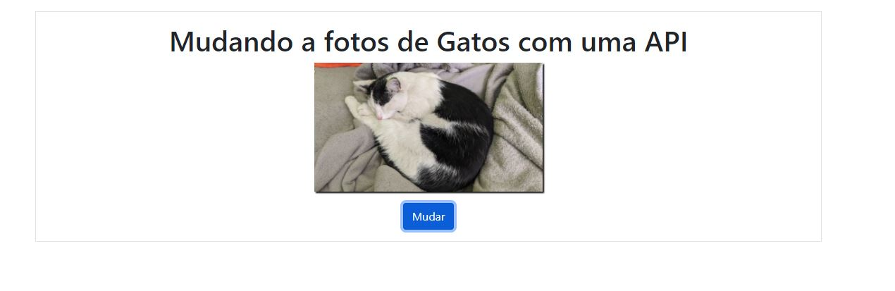

# Digital_inovation_one
<h2>Tecnologias usada nesse Projeto</h2>

Projeto onde consumimos uma api para fazer um pagina onde aparece um gato aleatorio 

Tratamento de erros  e javaScript orientado a objetos 

;

Uso de exercicios com Map Filter e Reduce em javaScript
